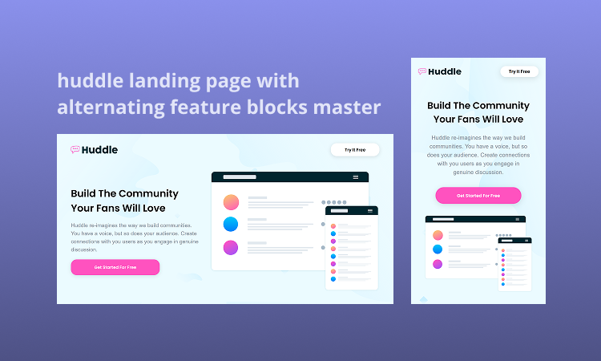

  

 

## 🚀 Tecnologias

Esse projeto foi desenvolvido com as seguintes tecnologias:

- HTML 
- CSS
- Frontend Mentor

 

## 💻 Projeto
Projeto exclusivo e gratuito, disponível pelo Frontend Mentor para ensino de tecnologias WEB.
 

## 🌐 Acesse o projeto
👉 [Huddle](https://erika-nicolly.github.io/Huddle-02/)

 